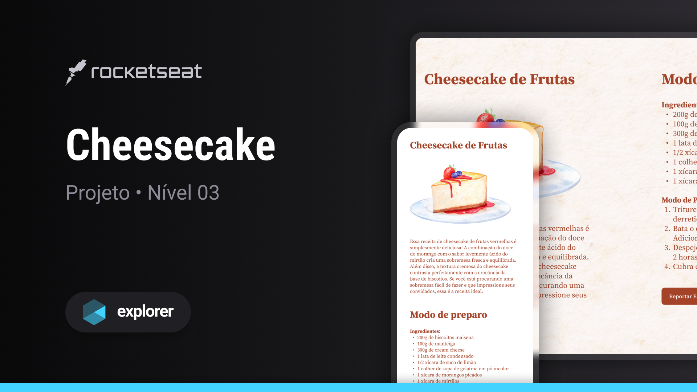

# Cheesecake
Esse projeto responsivo de página de receita de um delicioso Cheesecake é desenvolvido no nível 03 do Explorer, curso da Rocketseat.

## Tecnologias usadas:
- HTML  
- CSS  
- Git

# Layout
Esse projeto foi feito a partir [desse](<https://www.figma.com/file/QICl3lMP3NuKaTk1XtOvrM/Cheesecake-%E2%80%A2-Projeto-Explorer-(Community)?type=design&node-id=1-754&mode=design>) layout do figma.
 
